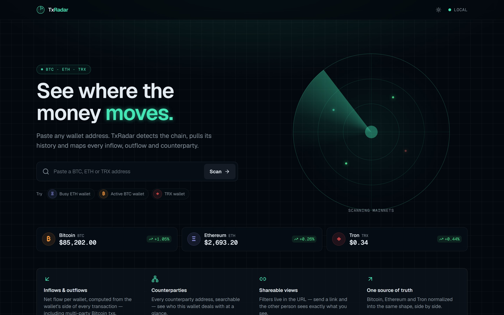
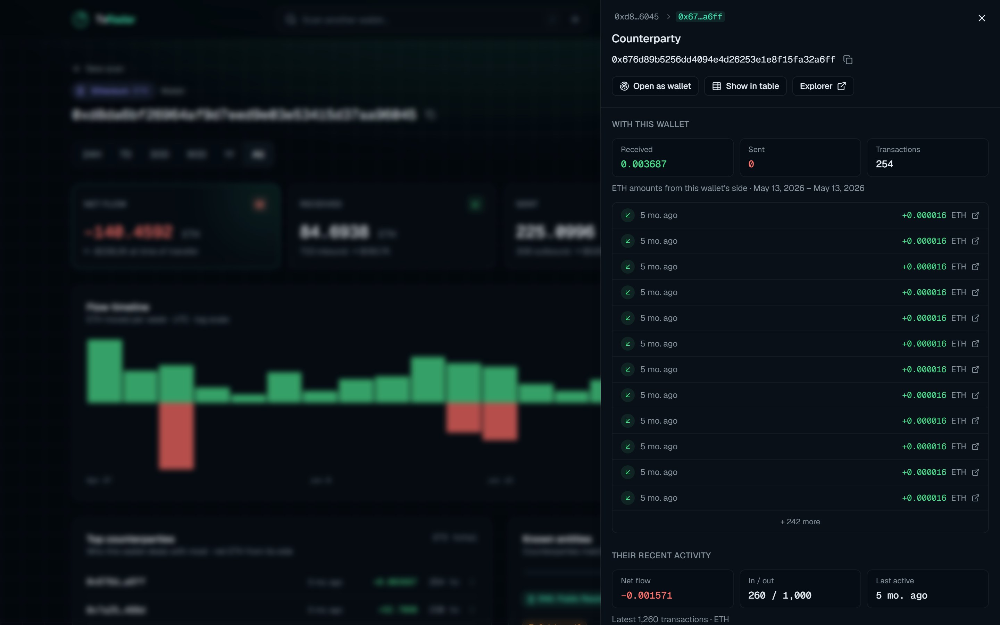
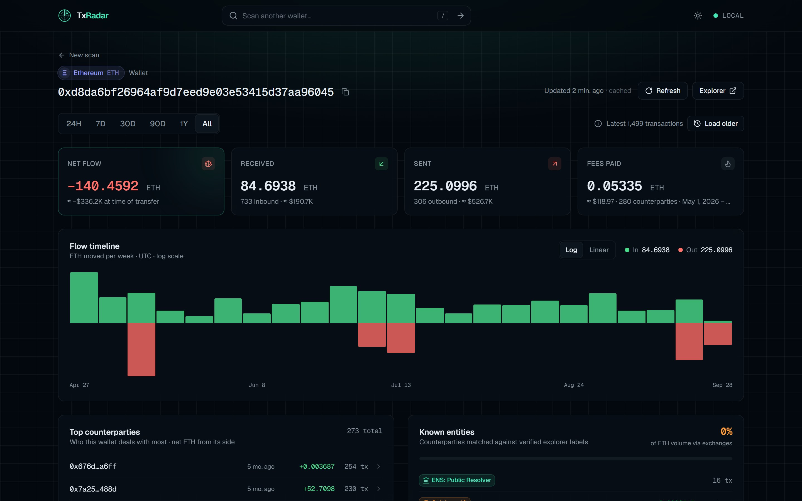
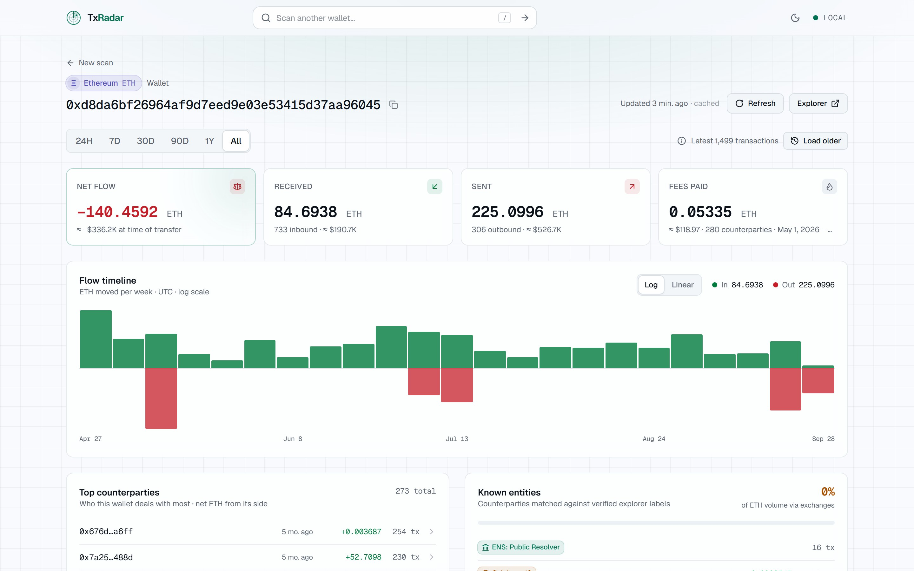

# TxRadar

[](https://github.com/bhogi1718/txradar/actions/workflows/ci.yml)
[](LICENSE)


A local-first crypto transaction tracker for Bitcoin, Ethereum and Tron. Paste a wallet
address and see its inflows, outflows, counterparties, tokens and exchange exposure —
no signup, no deployment, no paid services.


<table>
  <tr>
    <td></td>
    <td></td>
  </tr>
  <tr>
    <td align="center"><sub>Search detects the chain from the address</sub></td>
    <td align="center"><sub>Follow the money through counterparties</sub></td>
  </tr>
  <tr>
    <td></td>
    <td></td>
  </tr>
  <tr>
    <td align="center"><sub>Counterparties, verified entities, tokens</sub></td>
    <td align="center"><sub>Light theme</sub></td>
  </tr>
</table>

This is a from-scratch rebuild of an earlier vanilla HTML/JS prototype, replacing
client-exposed API keys and unreliable data sources with a proper Next.js app.

## Features

- **Chain auto-detection** — paste any BTC, ETH or TRX address; no chain picker.
- **Wallet overview** — net flow, received, sent and fees, with USD at each transfer's
  own day (falls back to today's price, labeled, when history doesn't reach).
- **Flow timeline** — inflow/outflow per hour/day/week/month, log or linear scale.
- **Transactions table** — sort, filter by direction/time window/failed, search by hash,
  address, method, token or entity name. Filters live in the URL, so views are shareable.
- **Deeper history** — "Load older" pages back through each explorer's full history.
- **Known entities** — verified exchange and contract labels, exchange share of volume.
- **Tokens** — ERC-20 on Ethereum and TRC-20 on Tron, priced where a market exists.
  Tokens missing from CoinGecko's token lists (airdropped spam) are hidden by default, and
  amounts worth more than 1% of a token's market cap are marked illiquid rather than shown
  as real money.
- **Complete Ethereum flows** — internal transactions included, so ETH paid out by
  contracts (exchange withdrawals, DEX returns, refunds) counts toward "Received".
- **Follow the money** — open any counterparty, see your relationship and their own
  activity, and drill up to five hops deep. The path is part of the URL.
- **CSV export** — the filtered, sorted rows, safe to open in Excel.
- **Dark and light themes**, keyboard-friendly, WCAG 2.1 AA-checked.

## Stack

- **Next.js 16** (App Router) + **TypeScript** (strict, `noUncheckedIndexedAccess`)
- **Tailwind CSS 4** + **shadcn/ui** (Base UI) — "radar console" design system
- **TanStack Query** (infinite queries) + **TanStack Table v9**
- **Zod** at every trust boundary (upstream responses, route inputs, URL params)
- **Vitest** + Testing Library (unit/integration), **Playwright** + axe (end-to-end, a11y)

## Getting started

```bash
npm install
cp .env.example .env.local   # then fill in ETHERSCAN_API_KEY
npm run dev
```

Open [http://localhost:3000](http://localhost:3000). Only `ETHERSCAN_API_KEY` is required
(free at [etherscan.io/apis](https://etherscan.io/apis)); TronGrid and CoinGecko keys are
optional and only raise rate limits.

## Data sources

| Chain    | Provider                                                                                                              | Key required?                |
| -------- | --------------------------------------------------------------------------------------------------------------------- | ---------------------------- |
| Bitcoin  | [Esplora](https://github.com/Blockstream/esplora) (blockstream.info by default; mempool.space via `ESPLORA_BASE_URL`) | No                           |
| Ethereum | [Etherscan V2](https://docs.etherscan.io/etherscan-v2)                                                                | Yes (free tier)              |
| Tron     | [TronGrid](https://www.trongrid.io/)                                                                                  | No (optional, raises limits) |
| Prices   | [CoinGecko](https://www.coingecko.com/en/api) (Demo API)                                                              | No (optional, raises limits) |

## Architecture

```
Browser                         Next.js server                         Upstream
───────                         ──────────────                         ────────
WalletView ── useTransactions ─▶ /api/transactions ─▶ TtlCache ─▶ chain adapter ─▶ Etherscan
  (infinite query, pages)         (Zod-validated)     (5 min,      (normalize,      Esplora
                                                       per page)    validate)        TronGrid
           ── usePrices ───────▶ /api/prices        ─┐
           ── usePriceHistory ─▶ /api/price-history ─┼─ TtlCache ─▶ CoinGecko client ─▶ CoinGecko
           ── useTokenPrices ──▶ /api/token-prices  ─┘
```

Key decisions:

- **Keys never reach the browser.** Every upstream call is made from a route handler;
  the client only talks to `/api/*`.
- **One `Transaction` shape.** Each chain adapter normalizes its explorer's response into
  the same Zod-validated model (direction, status, category, asset, fee), so the UI never
  branches on chain. Bitcoin direction is computed from the wallet's _net_ position, so
  multi-party transactions classify correctly.
- **Cursor pagination per adapter.** Opaque cursors — an Etherscan page number, the last
  Esplora txid, or TronGrid fingerprints for the native and TRC-20 lists. The client
  combines pages, dropping seam duplicates and re-merging Tron token transfers whose
  contract-call row landed on another page.
- **Only successes are cached.** An in-memory TTL cache with request coalescing; failures
  aren't stored. After a 429, calls to that provider fail fast until its `Retry-After`
  passes instead of extending the penalty.
- **Enrichment never fails a scan.** Contract detection, token history and token prices are
  best effort; if they fail, the core history still renders.
- **Honest numbers.** USD values say whether they used the transfer day's price or today's;
  a token with no market is "unverified", but a failed lookup is only "price unavailable".
- **Labels are curated and sourced.** Every entry in `src/lib/labels/registry.ts` links to
  the public explorer page it was verified against. A wrong label is worse than none.
- **No `useSearchParams`.** The server parses filters and passes them down; the client
  mirrors changes with `history.replaceState` after render. This avoids a Suspense
  boundary whose reveal stalls in background tabs.
- **Errors are contained.** Each wallet section has its own error boundary, so one
  failing panel can't take the page down.

## Security & performance

- **Strict, nonce-based CSP.** `src/proxy.ts` issues a fresh nonce per request; scripts run
  only with that nonce (`'strict-dynamic'`, no `'unsafe-inline'`, no `eval` in
  production), `connect-src` is limited to this origin, and framing is blocked. An e2e spec
  drives the app and fails on any CSP violation.
- **Hardening headers** on every response: `nosniff`, `X-Frame-Options: DENY`, a strict
  referrer policy, `Cross-Origin-Opener-Policy`, a deny-all `Permissions-Policy`, and no
  `X-Powered-By`.
- **Compressed API responses.** Route Handlers gzip their JSON (Next only compresses pages
  and static files): a 1,000-transaction page goes from ~680 KB to ~90 KB.
- **Lighthouse** (production build, desktop preset): Performance 99 home / 97 wallet,
  Accessibility 100, Best Practices 100. SEO reports 60 only because pages are deliberately
  `noindex` — wallet pages aren't meant for search engines.

## Scripts

| Command                 | Does                                                       |
| ----------------------- | ---------------------------------------------------------- |
| `npm run dev`           | Start the dev server                                       |
| `npm run build`         | Production build                                           |
| `npm run start`         | Serve the production build                                 |
| `npm run lint`          | ESLint                                                     |
| `npm run typecheck`     | Generate route types + `tsc --noEmit`                      |
| `npm test`              | Unit/integration tests (Vitest)                            |
| `npm run test:watch`    | Vitest in watch mode                                       |
| `npm run test:coverage` | Vitest with coverage (fails under the thresholds)          |
| `npm run e2e`           | End-to-end + accessibility tests (Playwright; build first) |
| `npm run format`        | Format with Prettier                                       |
| `npm run screenshots`   | Regenerate README screenshots from a running app           |
| `npm run check`         | lint + typecheck + format check + unit tests               |

A pre-commit hook (Husky + lint-staged) runs ESLint and Prettier on staged files.

## Testing

- **Unit/integration (Vitest)** — adapters run against _recorded_ explorer responses in
  `src/lib/chains/__fixtures__`; analytics, valuation, CSV and caching are pure and tested
  directly; components are tested with Testing Library in happy-dom.
- **End-to-end (Playwright)** — runs against the production build with every `/api/*`
  call mocked in the browser, so it's deterministic and needs no keys. Covers search,
  each chain's wallet page, filters + URL state, drill-down, CSV download, pagination,
  error states, 404 and phone layouts.
- **Accessibility** — axe scans (WCAG 2.1 A/AA) of the home page, wallet pages and the
  inspector in both themes fail the build on serious or critical issues.
- **Coverage gate** — CI fails if unit coverage drops below 78% lines/statements, 73%
  branches or 68% functions (currently ~80 / 75 / 70). Page-level wiring such as the
  wallet view is exercised by Playwright instead.
- **Security** — e2e checks the CSP and hardening headers, and that a full session (load,
  inspect, theme switch) triggers no CSP violations.

First run: `npx playwright install chromium`, then `npm run build && npm run e2e`.

## CI

GitHub Actions on every push and PR: lint · typecheck · format, unit tests with enforced
coverage thresholds, production build, and Playwright end-to-end, accessibility and
security tests. Dependabot keeps dependencies current.

## Project structure

```
src/
  app/
    api/                # Route handlers: transactions, prices, price-history, token-prices, health
    [chain]/[address]/  # Wallet page
    ...                 # Home, layout, 404, error page, design tokens (globals.css)
  components/
    brand/              # RadarMark
    common/             # Segmented control, chain badge, address, radar scope, error boundary
    layout/             # Header, footer, theme toggle
    search/             # Wallet search with chain auto-detect, samples, recents
    wallet/             # Summary, flow chart, panels, table, inspector, states
    ui/                 # shadcn/ui primitives
  hooks/                # useTransactions (infinite), prices, URL-backed filters, recents
  lib/
    analytics/          # Summary, buckets, filters, valuation, counterparties (pure)
    api/                # Shared request/response contracts, envelope, browser client
    chains/             # Adapters, address validation/detection, pagination, units, HTTP
    export/             # CSV export (RFC 4180, formula-injection safe)
    labels/             # Curated, source-linked address labels
    prices/             # CoinGecko client (current, daily history, token prices)
    schemas/            # Zod schemas: Chain, Transaction, Asset
    security/           # Content-Security-Policy builder
    cache.ts            # In-memory TTL cache with request coalescing
    env.ts              # Validated server-side environment
  proxy.ts              # Per-request CSP nonce
e2e/                    # Playwright specs + API mocks
```

## Status

All six planned phases are complete:

- ✅ Phase 0 — Scaffold, design system, CI/CD pipeline
- ✅ Phase 1 — Chain adapters (normalized `Transaction` model, fixture-backed tests)
- ✅ Phase 2 — API routes (validated, cached, uniform error envelope)
- ✅ Phase 3 — Core UI (auto-detecting search, summary, flow timeline, table, URL filters)
- ✅ Phase 4 — Enrichment (transfer-day USD, verified labels, ETH account types, TRC-20)
- ✅ Phase 5 — Counterparty inspector with drill-down, top counterparties, CSV export
- ✅ Phase 6 — Hardening (cursor pagination, error boundaries, light theme, a11y,
  Playwright e2e)
- ✅ Polish — ERC-20 + internal transactions, spam and liquidity checks, dependency and
  CI upkeep, screenshots, license
- ✅ Quality gates — coverage thresholds, strict CSP + security headers, gzipped API,
  Lighthouse audit

Known limits: the label set is deliberately small; TRC-10 token amounts are shown in raw
units because TronGrid doesn't report their decimals; token USD values use today's price
(CoinGecko's keyless tier has no per-day token history).

## License

[MIT](LICENSE)

## Notes

- Runs locally only — no deployment target and no database. Everything is fetched live
  from public block explorers.
- `.env.local` is gitignored; never commit real API keys. `.env.example` documents what's
  needed.
