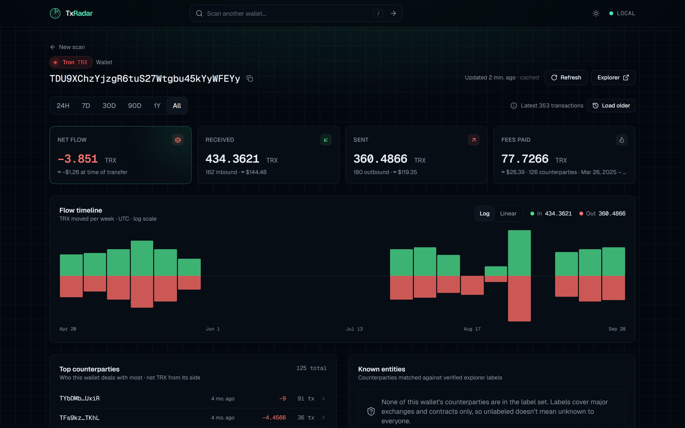
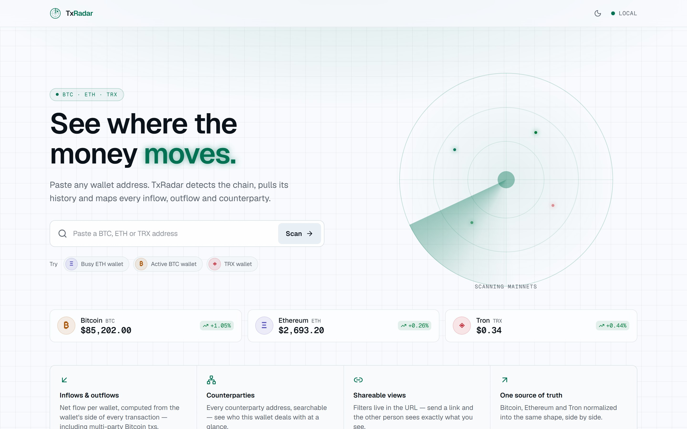
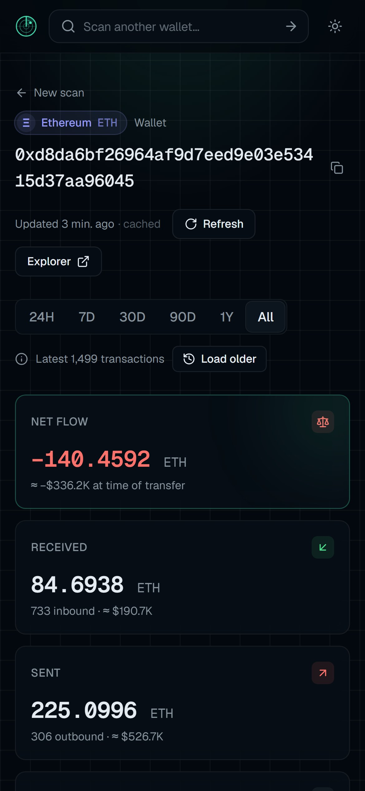
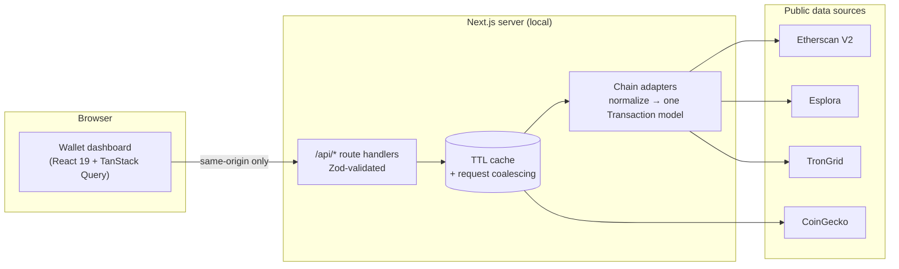

<div align="center">

# 📡 TxRadar

**See where the money moves.**

A fast, private, local-first transaction explorer for **Bitcoin**, **Ethereum** and **Tron**.
Paste any wallet address and get its inflows, outflows, tokens, counterparties and exchange
exposure on one radar-style dashboard. No signup, no paid services, no data leaves your machine
except calls to public block explorers.

[](https://github.com/bhogi1718/txradar/actions/workflows/ci.yml)
[](LICENSE)


<br />


[Features](#-features) · [Screenshots](#-screenshots) · [Quick start](#-quick-start) ·
[How it works](#-how-it-works) · [Quality](#-quality) · [Tech stack](#-tech-stack)

<br />


</div>

---

## ✨ Features

### 🔎 Search that just works

- **Chain auto-detection.** Paste any BTC (legacy, P2SH or bech32), ETH or TRX address. There's
  no chain picker; TxRadar validates the address and routes to the right chain.
- **Sample and recent wallets.** One click to try a busy wallet, and your recent searches are
  remembered locally.

### 📊 Wallet overview at a glance

- **Net flow, received, sent and fees**, in coins and in USD.
- **Honest USD values.** Each transfer is valued at **its own day's price**. When price history
  doesn't reach that far back, it falls back to today's price and says so.
- **Flow timeline.** Inflow and outflow per hour, day, week or month, on a log or linear scale.
- **Live prices** for BTC, ETH and TRX on the home page.

### 📜 A transactions table built for digging

- **Sort, filter and search.** Filter by direction (in, out, self), time window, or hide failed
  transactions. Search by hash, address, method, token symbol or entity name.
- **Shareable views.** Filters live in the URL, so a filtered view is a link you can send.
- **Deep history.** "Load older" pages back through each explorer's full history: thousands
  of transactions, with duplicates across pages removed automatically.
- **CSV export** of exactly the rows you're looking at, safe to open in Excel (formula
  injection is defused).

### 🪙 Tokens done right

- **ERC-20** on Ethereum and **TRC-20 / TRC-10** on Tron, each shown as its own movement with
  its own symbol and amount.
- **Spam filtering.** Airdropped junk tokens (not on CoinGecko's token lists) are hidden by
  default and can be revealed with one checkbox.
- **Liquidity check.** An amount worth more than 1% of a token's whole market cap is flagged
  **illiquid** instead of being counted as real money.
- **One row per transfer.** A token send's contract call and its transfer are merged into one
  row, and the gas fee is charged once, even for multi-token swaps.

### ⛓️ Complete Ethereum flows

- **Internal transactions included.** ETH sent to the wallet by contracts (exchange
  withdrawals, DEX payouts, refunds) counts toward "Received". Without these, most explorers'
  basic views undercount inflows.
- **Account types.** Counterparties are classified as wallets or contracts, including
  EIP-7702 delegated accounts (still treated as wallets).

### 🕵️ Follow the money

- **Counterparty inspector.** Open any address to see your full relationship with it (volume
  each way, first and last contact) and its own recent activity.
- **Drill-down.** Hop from counterparty to counterparty up to five levels deep, with a
  breadcrumb trail that's part of the URL.
- **Top counterparties** ranked by volume.
- **Known entities.** Verified labels for major exchanges (Binance, Coinbase, Kraken, OKX,
  Bitfinex, Gemini, Robinhood) and contracts (USDT, USDC, WETH, Uniswap, ENS), plus the share
  of volume that touched an exchange. Every label links to the source it was verified against.

### 🎨 Designed, not assembled

- A unique **"radar console"** design system with an animated scope, phosphor accents and
  monospaced data.
- **Dark and light themes**, following your OS if you like.
- **Fully responsive**, from a phone to an ultrawide monitor.
- **Accessible.** Keyboard-friendly, with a skip link and screen-reader labels; checked
  against WCAG 2.1 AA in both themes on every commit.
- **Resilient.** Every section has its own error boundary, and rate limits and upstream outages
  show clear, recoverable states instead of a blank page.

---

## 📸 Screenshots

<table>
  <tr>
    <td width="50%"></td>
    <td width="50%"></td>
  </tr>
  <tr>
    <td align="center"><sub><b>Home</b> · the search detects the chain from the address</sub></td>
    <td align="center"><sub><b>Inspector</b> · follow the money through counterparties</sub></td>
  </tr>
  <tr>
    <td></td>
    <td></td>
  </tr>
  <tr>
    <td align="center"><sub><b>Panels</b> · counterparties, verified entities, tokens</sub></td>
    <td align="center"><sub><b>Tron</b> · TRX and TRC-20 activity</sub></td>
  </tr>
  <tr>
    <td></td>
    <td></td>
  </tr>
  <tr>
    <td align="center"><sub><b>Light theme</b> · wallet view</sub></td>
    <td align="center"><sub><b>Light theme</b> · home</sub></td>
  </tr>
</table>

<p align="center">
  
  <br />
  <sub><b>Mobile</b> · the full dashboard on a phone</sub>
</p>

---

## 🚀 Quick start

**Prerequisites:** [Node.js](https://nodejs.org) 22.12 or newer, and a free
[Etherscan API key](https://etherscan.io/apis) (takes a minute to get).

```bash
git clone https://github.com/bhogi1718/txradar.git
cd txradar
npm install
cp .env.example .env.local   # then paste your key into ETHERSCAN_API_KEY
npm run dev
```

Open **[http://localhost:3000](http://localhost:3000)** and paste an address, or click one of
the sample wallets.

| Variable            | Required | What it's for                                        |
| ------------------- | -------- | ---------------------------------------------------- |
| `ETHERSCAN_API_KEY` | ✅ Yes   | Ethereum history (free tier is plenty)               |
| `TRONGRID_API_KEY`  | Optional | Raises Tron rate limits; works without it            |
| `COINGECKO_API_KEY` | Optional | Raises price rate limits; works without it           |
| `ESPLORA_BASE_URL`  | Optional | Use a different Bitcoin Esplora (e.g. mempool.space) |

For the fastest experience, run the production build: `npm run build && npm start`.

> [!NOTE]
> Keys stay on your machine. `.env.local` is gitignored, and keys are only used server-side;
> the browser never sees them.

---

## 🧭 How it works



**Key design decisions**

- **Keys never reach the browser.** Every upstream call happens in a route handler; the
  client only talks to `/api/*`, and the CSP enforces that.
- **One `Transaction` shape.** Each chain adapter converts its explorer's format into the same
  Zod-validated model (direction, status, category, asset, fee), so the UI never branches on
  chain. Bitcoin direction uses the wallet's _net_ position, so multi-input transactions
  classify correctly.
- **Cursor pagination per adapter.** Opaque cursors (an Etherscan page per list, the last
  Esplora txid, TronGrid fingerprints) let "Load older" walk the full history. The client
  merges pages, removes duplicates at page boundaries and re-pairs token transfers that
  landed on different pages.
- **Only successes are cached.** After a `429`, calls to that provider fail fast until its
  `Retry-After` passes instead of extending the penalty.
- **Extra data never breaks a scan.** Contract detection, token history and token prices are
  best effort; if they fail, the core history still renders.
- **Honest numbers.** Every USD value says which price it used. A token with no market is
  "unverified", but a failed price lookup is only "price unavailable", never spam.
- **Curated, sourced labels.** A wrong label is worse than none, so every entry in
  [`registry.ts`](src/lib/labels/registry.ts) links to the explorer page it was verified on.

---

## ✅ Quality

| Gate                 | Result                                                                    |
| -------------------- | ------------------------------------------------------------------------- |
| **Unit/integration** | 316 tests (Vitest); adapters run against recorded explorer responses      |
| **End-to-end**       | 29 tests (Playwright) on the production build, desktop and phone          |
| **Coverage**         | Enforced in CI: ≥78% lines, ≥73% branches, ≥68% functions                 |
| **Accessibility**    | axe WCAG 2.1 A/AA scans of every page, in both themes                     |
| **Lighthouse**       | Performance **99** / Accessibility **100** / Best Practices **100**       |
| **Security**         | Strict nonce CSP, hardening headers, zero CSP violations (tested)         |
| **Types**            | TypeScript `strict` + `noUncheckedIndexedAccess`; Zod at every boundary   |
| **CI/CD**            | Lint · typecheck · format → tests → build → e2e on every push; Dependabot |

<details>
<summary><b>Security details</b></summary>

- **Content-Security-Policy with a fresh nonce per request** (issued in
  [`src/proxy.ts`](src/proxy.ts)). Scripts run only with that nonce (`'strict-dynamic'`, no
  `'unsafe-inline'`, no `eval` in production), `connect-src` is limited to this origin, and
  framing is blocked.
- **Hardening headers** on every response: `X-Content-Type-Options: nosniff`,
  `X-Frame-Options: DENY`, `Referrer-Policy`, `Cross-Origin-Opener-Policy`, a deny-all
  `Permissions-Policy`, and no `X-Powered-By`.
- **Input validation.** Every route input, URL parameter and upstream response is parsed
  with Zod.
- **CSV export** defuses spreadsheet formula injection.
- **Secrets hygiene.** Keys are server-only and `.env.local` is gitignored.

</details>

<details>
<summary><b>Performance details</b></summary>

- **Gzipped API responses.** A 1,000-transaction page shrinks from ~680 KB to ~90 KB.
- **Server-side cache with request coalescing**, so repeat views and parallel requests cost
  one upstream call.
- **Paginated table.** Thousands of transactions stay smooth.
- Lighthouse, production build, desktop preset: 99 home / 97 wallet. SEO is intentionally
  60 because pages are marked `noindex`; wallet pages aren't meant for search engines.

</details>

---

## 🛠️ Tech stack

| Layer      | Tools                                                                 |
| ---------- | --------------------------------------------------------------------- |
| Framework  | **Next.js 16** (App Router, Turbopack), **React 19**                  |
| Language   | **TypeScript** (strict)                                               |
| UI         | **Tailwind CSS 4**, **shadcn/ui** (Base UI), lucide icons, sonner     |
| Data       | **TanStack Query** (infinite queries), **TanStack Table v9**          |
| Validation | **Zod 4**                                                             |
| Testing    | **Vitest**, Testing Library, happy-dom, **Playwright**, axe-core      |
| Tooling    | ESLint, Prettier, Husky + lint-staged, GitHub Actions, Dependabot     |
| Data       | Etherscan V2 · Esplora (Blockstream) · TronGrid · CoinGecko (keyless) |

---

## 📜 Scripts

| Command                 | What it does                                               |
| ----------------------- | ---------------------------------------------------------- |
| `npm run dev`           | Start the dev server at localhost:3000                     |
| `npm run build`         | Production build                                           |
| `npm start`             | Serve the production build                                 |
| `npm run check`         | Lint + typecheck + format check + unit tests               |
| `npm test`              | Unit/integration tests (Vitest)                            |
| `npm run test:coverage` | Tests with coverage (fails under the thresholds)           |
| `npm run e2e`           | End-to-end, accessibility and security tests (build first) |
| `npm run lint`          | ESLint                                                     |
| `npm run typecheck`     | Generate route types + `tsc --noEmit`                      |
| `npm run format`        | Format with Prettier                                       |
| `npm run screenshots`   | Regenerate the README screenshots from a running app       |

A pre-commit hook runs ESLint and Prettier on staged files. First e2e run:
`npx playwright install chromium`, then `npm run build && npm run e2e`.

<details>
<summary><b>Project structure</b></summary>

```
src/
  app/
    api/                # Route handlers: transactions, prices, price-history, token-prices, health
    [chain]/[address]/  # Wallet page
    ...                 # Home, layout, 404, error page, design tokens (globals.css)
  components/
    common/             # Segmented control, chain badge, address, radar scope, error boundary
    layout/             # Header, footer, theme toggle
    search/             # Wallet search with chain auto-detect, samples, recents
    wallet/             # Summary, flow chart, panels, table, inspector, states
    ui/                 # shadcn/ui primitives
  hooks/                # useTransactions (infinite), prices, URL-backed filters, recents
  lib/
    analytics/          # Summary, buckets, filters, valuation, tokens, counterparties (pure)
    api/                # Request/response contracts, response envelope, browser client
    chains/             # Adapters, address validation/detection, pagination, merging, HTTP
    export/             # CSV export (RFC 4180, formula-injection safe)
    labels/             # Curated, source-linked address labels
    prices/             # CoinGecko client (current, daily history, token prices)
    schemas/            # Zod schemas: Chain, Transaction, Asset
    security/           # Content-Security-Policy builder
    tokens/             # Token lists (spam detection)
    cache.ts            # In-memory TTL cache with request coalescing
    env.ts              # Validated server-side environment
  proxy.ts              # Per-request CSP nonce
e2e/                    # Playwright specs + API mocks
scripts/                # Screenshot generator
```

</details>

---

## 🗺️ Roadmap & known limits

- [x] Bitcoin, Ethereum and Tron wallets with full paginated history
- [x] ERC-20, TRC-20, TRC-10 and Ethereum internal transactions
- [x] Counterparty inspector with multi-hop drill-down
- [x] Spam and liquidity detection, CSV export, light and dark themes
- [x] CI quality gates: coverage, accessibility, security, e2e
- [ ] More EVM chains (Etherscan V2 already supports them with the same key)
- [ ] Faster wallet page on low-end phones (move analytics into a Web Worker)
- [ ] A larger set of verified entity labels

Known limits: token USD values use today's price (CoinGecko's free tier has no daily token
history); TRC-10 amounts are shown in raw units because TronGrid doesn't report their
decimals; the label set is deliberately small but verified.

---

## ⚠️ Disclaimer

TxRadar reads public blockchain data for informational purposes only. It is not financial
advice, and labels and prices come from third-party sources that can be incomplete or wrong.

## 🙏 Acknowledgements

Data from [Etherscan](https://etherscan.io), [Blockstream Esplora](https://blockstream.info),
[TronGrid](https://www.trongrid.io) and [CoinGecko](https://www.coingecko.com). UI built on
[shadcn/ui](https://ui.shadcn.com) and [Base UI](https://base-ui.com).

## 📄 License

[MIT](LICENSE) © 2026 Charan Tej

<div align="center">
<sub>Built with Next.js, TypeScript and a lot of block explorer JSON.</sub>
</div>
